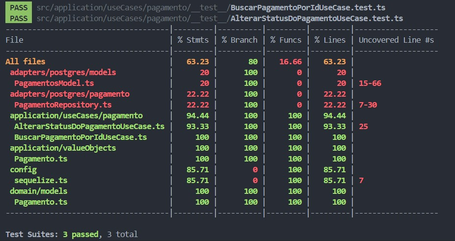
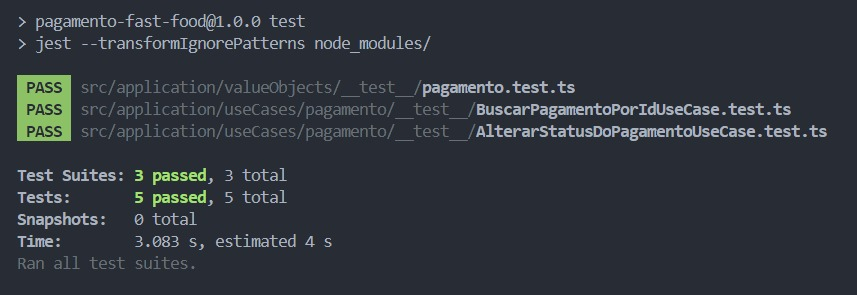

# TechChallenge: Microsserviço de pagamento

## Introdução

Bem-vindo à documentação do projeto para o sistema de gerenciamento de pagamento. Este guia fornece instruções detalhadas sobre como configurar, executar e interagir com a API pagamento.

## Pré-requisitos

Antes de iniciar, certifique-se de ter as seguintes ferramentas instaladas em sua máquina:

```
- Docker & Docker Compose
```

## Configuração do Projeto

1.  **Clone o Repositório:**

    ```bash
    git clone git@github.com:techChallenge-SOAT/pagamento-fast-food.git
    cd pagamento-fast-food
    ```

2.  **Suba a aplicação:**

# deploy utilizando cloud|Formation localmente

- **instalar o serverless framework**
  ```bash
  npm i -g serverless
  ```
- **instalar as dependências**
  ```bash
  npm install
  ```
- **buildar a aplicação**
  ```bash
  npm run build
  ```
- **realizar o deploy via serverless**
  `bash
	serverless deploy
	`
  Lembre-se atualizar a envs
  DATABASE_URL
  URL_PEDIDO
  URL_PAGAMENTO (para realização da simulação de confirmação de pagamento)

# Rotas da API

## pagamento

1.  **Criar QRCode pagamento**

    - **Método:** `POST`
    - **Endpoint:** `/pagamento`
    - **Exemplo Requisição:**

      ```json
      {
        "cliente_cpf": "12345678900",
        "id_pedido": "670d7b97-e82e-47f4-bb4a-cd3f05865c90",
        "descricao_produto": "Detalhes do pedido",
        "valor": 20
      }
      ```

1.  **Gerar pagamento pedido**
    - **Método:** `POST`
    - **Endpoint:** `/webhooks/pagamento/mercadopago/confirmacao`
    - **Exemplo Requisição:**
      ```json
      {
        "id_pedido": "371a1359-37fe-468c-9f36-b2509fed34e7",
        "status": "Pago"
      }
      ```

# Caminho feliz para teste

### Funcionalidade: `Pagamento`

**Contexto:**
_Dado_ que eu tenha um item cadastrado

**Cenário:** `Pagamento`

_Dado_ que crie um pedido com pelo menos 1 item
_Quando_ realize o pagamento do pedido
_Então_ status do pagamento deve ser atualizado para pago

> [!NOTE]
>
>1. Gerar pagamento pedido
>2. Atualizar status Pedido para `Aguardando Pagamento`
>3. Atualizar status Pedido para `pago`

# SAGA

- **Escolha:** Orquestrador
  
A escolha do padrão SAGA de Orquestração para um sistema de pedido de fast food é justificada por:

**Controle Centralizado:** O orquestrador gerencia o fluxo de pedidos, coordenando etapas como preparação, pagamento e entrega.

**Visibilidade e Monitoramento**: Proporciona visibilidade clara do status dos pedidos, facilitando o monitoramento e a resolução de problemas em tempo real.

**Lógica de Compensação**: Simplifica a gestão de falhas, acionando transações compensatórias quando necessário para manter a consistência.

**Gestão de Falhas e Retries**: O orquestrador pode gerenciar falhas e tentativas de forma centralizada, garantindo a conclusão ou reversão adequada das transações.

**Facilidade de Expansão**: Permite adicionar novas funcionalidades sem impactar os serviços individuais.

**Consistência dos Dados**: Assegura que os dados sejam consistentes em todo o sistema.

Em resumo, a orquestração oferece controle preciso, adaptabilidade e uma experiência de usuário confiável em sistemas de pedido de fast food.

**Arquivo de configuração da maquinha de estado**

 - Step Functions: 
 [workflow da maquina de estado](https://github.com/techChallenge-SOAT/pagamento-fast-food/blob/main/assets/workflowStepFunction.json)

# Evidências de testes

- Testes criados
  

- Testes Executados
  
